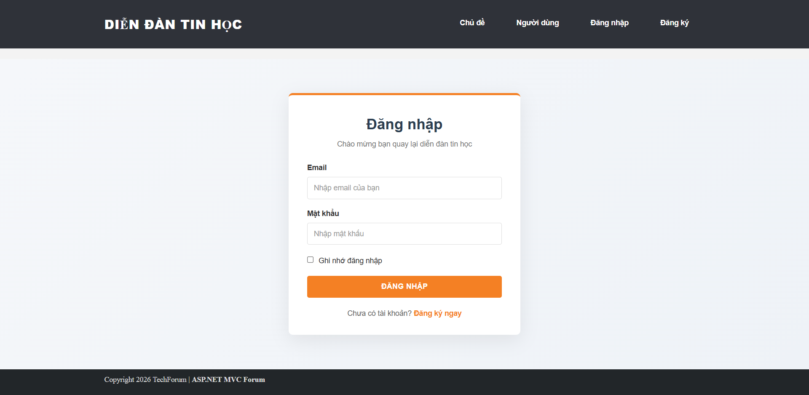
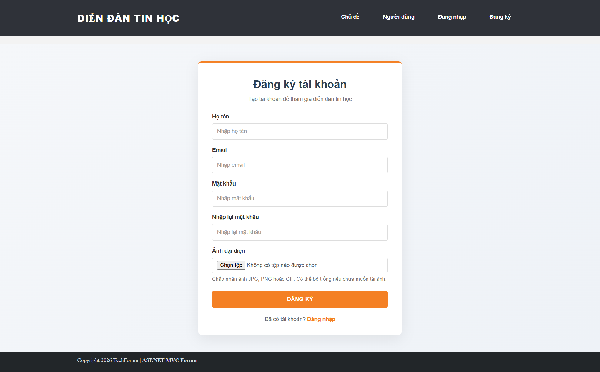
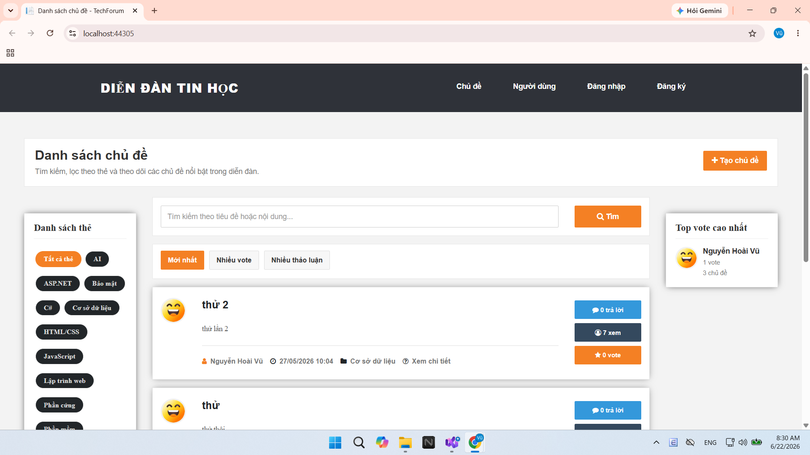
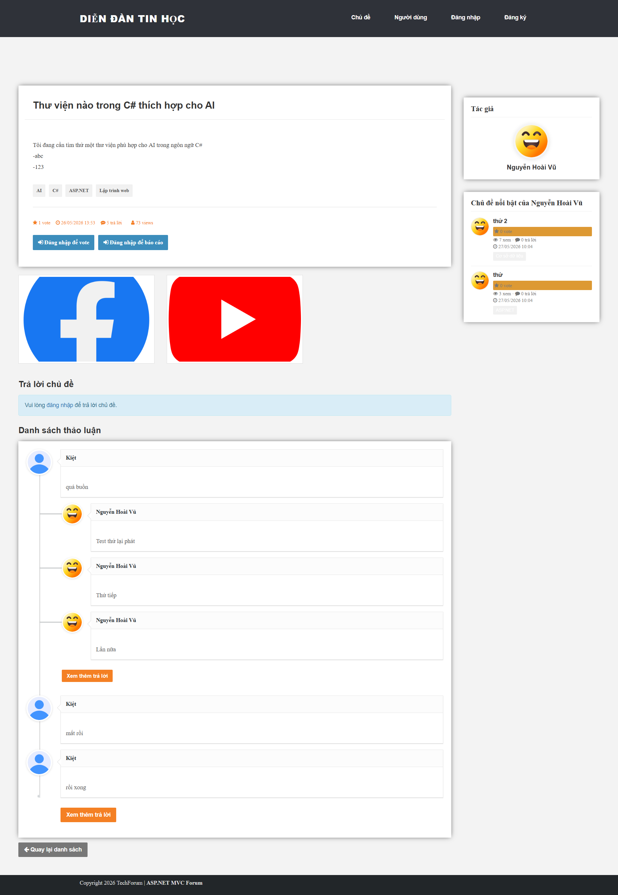
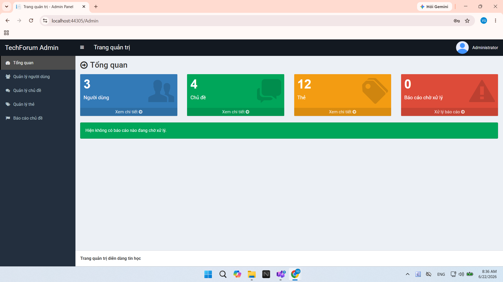

# TechForum - Website Diễn Đàn Tin Học

**TechForum** là một nền tảng diễn đàn thảo luận trực tuyến đơn giản về tin học, được xây dựng trên nền tảng **ASP.NET MVC 5 (.NET Framework)** kết hợp với **SQL Server**. Hệ thống cho phép người dùng chia sẻ kiến thức, đặt câu hỏi, tương tác thông qua hệ thống bình luận, vote, và quản lý nội dung vi phạm dưới sự kiểm soát của Quản trị viên (Admin).

---

## 🚀 Mục Tiêu Dự Án

Dự án được phát triển nhằm mô phỏng một cộng đồng công nghệ thu nhỏ, tạo không gian kết nối cho các người yêu công nghệ với các tính năng cốt lõi:
* **Thảo luận & Hỏi đáp:** Đăng tải bài viết, đặt câu hỏi về các chủ đề công nghệ.
* **Phân loại thông minh:** Gắn thẻ (Tags) xu hướng như `AI`, `C#`, `SQL Server`, `ASP.NET`, `Phần mềm`,... giúp dễ dàng tìm kiếm.
* **Tương tác đa chiều:** Vote bài viết hữu ích, trả lời chủ đề và để lại bình luận (comment) trong từng câu trả lời.
* **Minh bạch & An toàn:** Cơ chế báo cáo (Report) nội dung vi phạm giúp Admin kịp thời xử lý, giữ môi trường diễn đàn lành mạnh.
* **Hồ sơ số:** Xem thông tin cá nhân, lịch sử hoạt động và bảng thống kê đóng góp của từng thành viên.

---

## 🛠️ Công Nghệ Sử Dụng

Dự án áp dụng kiến trúc chuẩn MVC và các công nghệ phổ biến trong hệ sinh thái .NET:

* **Backend:** ASP.NET Web Application (.NET Framework 4.7.x / 4.8)
* **Framework:** ASP.NET MVC 5
* **ORM / Data Access:** Entity Framework 6 (Code First / Database First)
* **Database:** Microsoft SQL Server
* **Frontend UI:** Razor View Engine, Bootstrap, HTML5, CSS3
* **Client Scripting:** jQuery, JavaScript, AJAX (tối ưu hóa trải nghiệm tương tác không tải lại trang)

---

## 📋 Các Chức Năng Chính

### 1. Dành cho Thành viên (User)
* **Xác thực tài khoản:** Đăng ký, đăng nhập, đăng xuất và tính năng "Ghi nhớ đăng nhập" (Remember me).
* **Quản lý cá nhân:** Thay đổi thông tin hiển thị (Họ tên, ảnh đại diện) và theo dõi dòng lịch sử hoạt động cá nhân.
* **Quản lý Chủ đề (Post):**
  * Tạo bài viết mới với tiêu đề, nội dung phong phú và đính kèm hình ảnh minh họa.
  * Tìm kiếm bài viết theo từ khóa, lọc theo Thẻ (Tag).
  * Sắp xếp danh sách linh hoạt: *Mới nhất*, *Số lượt vote cao nhất*, hoặc *Số lượng thảo luận nhiều nhất*.
* **Tương tác chi tiết:**
  * Xem chi tiết bài đăng (Nội dung, hình ảnh, tác giả, lượt xem, lượt vote).
  * Thực hiện Vote bài viết, viết câu trả lời (Answer), và bình luận lồng nhau (Comment on Answer).
  * Báo cáo (Report) bài viết vi phạm tiêu chuẩn cộng đồng.
* **Trang Thành viên:** Danh sách user kèm thống kê tổng số bài đăng, tổng lượt vote nhận được, và số lượng thảo luận đã tham gia.

### 2. Khu vực Quản trị (Admin Dashboard)
* **Thống kê tổng quan:** Số liệu trực quan về số lượng người dùng, chủ đề, thẻ tag và số lượng báo cáo đang chờ duyệt.
* **Quản lý Thành viên:** Duyệt danh sách user, thực hiện Khóa (Lock) hoặc Mở khóa (Unlock) tài khoản vi phạm.
* **Quản lý Nội dung:** Kiểm duyệt và xóa bỏ các chủ đề không phù hợp.
* **Quản lý Thẻ (Tags):** Thêm, sửa, xóa các thẻ phân loại trong hệ thống.
* **Xử lý Báo cáo:** Tiếp nhận và xử lý nhanh các phiếu báo cáo vi phạm từ người dùng gửi lên.

---

## 📷 Giao Diện Hệ Thống

### Đăng nhập

### Đăng ký

### Trang chủ & Danh sách chủ đề

### Trang chi tiết bài đăng & Thảo luận

### Khu vực Quản trị dành cho Admin

---

## 🔐 Tài Khoản Kiểm Thử (Test Accounts)

Bạn có thể sử dụng các tài khoản demo sau để trải nghiệm toàn bộ tính năng của hệ thống:

| Vai trò (Role) | Email | Mật khẩu | Quyền hạn |
| :--- | :--- | :--- | :--- |
| **Admin** | `admin@gmail.com` | `123456` | Toàn quyền quản trị hệ thống, duyệt report, quản lý user. |
| **User** | `vu@gmail.com` | `123456` | Đăng bài, vote, trả lời, bình luận và báo cáo. |
